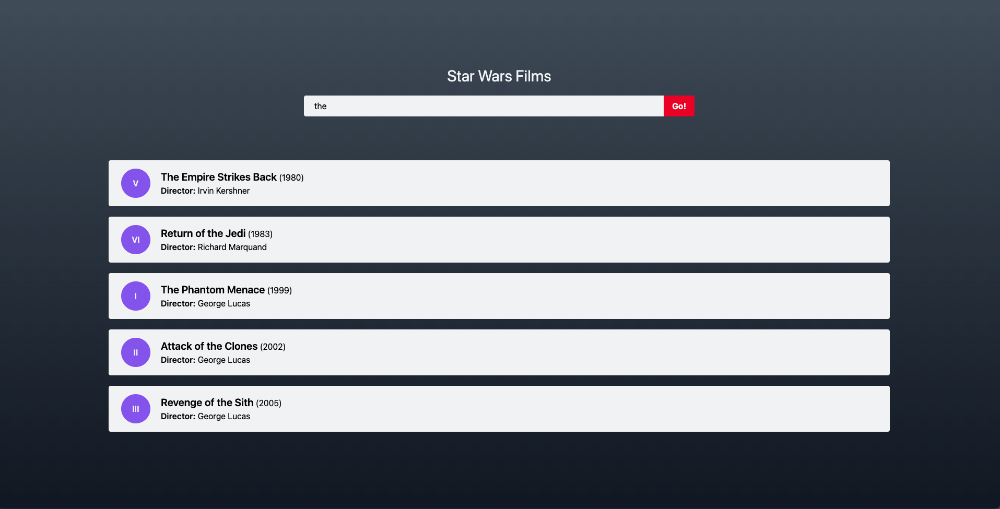
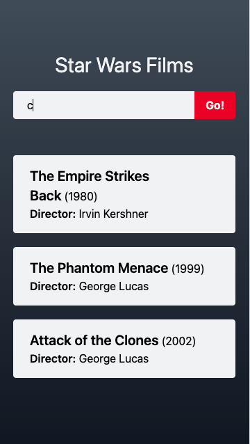

# Star Wars Films

Small application in which we can see information about Star Wars.

## Getting started

In order to start a development server, we must install [docker](https://docs.docker.com/engine/installation/)
and [docker compose](https://docs.docker.com/compose/install/).

1\. Run the next command for installing dependencies:

```bash
$ make install
```

2\. Start the development server:

```bash
$ make start
```

3\. Finally go to [http://localhost:3000](http://localhost:3000) and enjoy!

## Running the tests

To launch end to end tests:

```bash
$ make test
```

Here you can see a video of how the tests are performed.

[](docs/videos/home_spec.js.mp4)

## Screenshots



